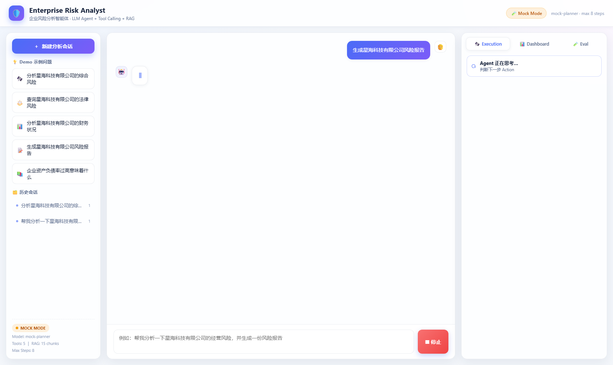
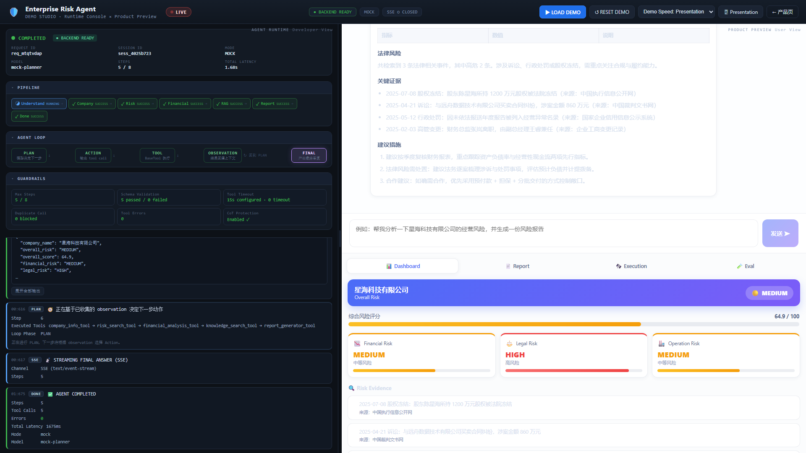
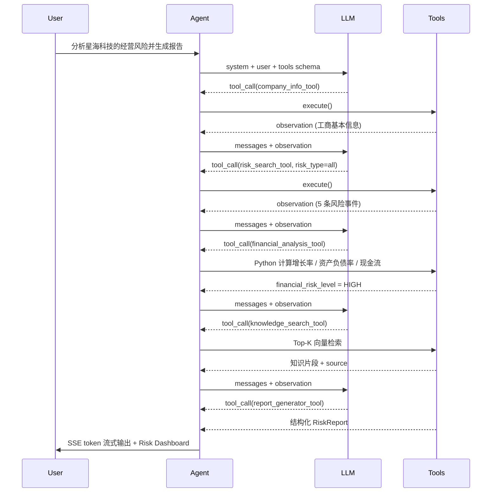
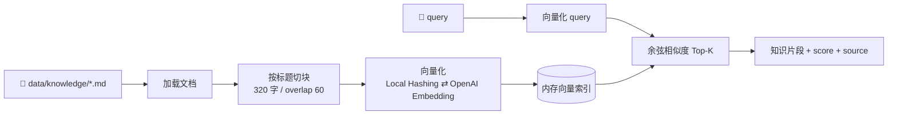

# 🛡️ Enterprise Risk Analyst Agent · 企业风险分析智能体

> 一个用于「AI 智能体开发工程师」面试展示的 **小而完整** 的 Agent Demo：
> LLM Agent + Tool Calling + RAG 检索 + 多步骤工作流 + 流式输出 + 执行过程可视化 + 轻量 Eval。

用户输入一句话 **「帮我分析一下星海科技有限公司的经营风险，并生成一份风险报告」**，
Agent 会自主规划步骤、依次调用 5 个工具、检索本地知识库、由 Python 精确计算财务指标，
最终输出结构化风险报告与可视化 Dashboard —— 整个过程在页面上实时可见。

---

## 1. 项目介绍

### 覆盖的能力点

| # | 能力 | 落地位置 |
| --- | --- | --- |
| 1 | LLM Agent | `backend/app/agents/orchestrator.py` |
| 2 | Tool / Function Calling | `backend/app/tools/*`（JSON Schema 自动推导） |
| 3 | RAG 知识库检索 | `backend/app/rag/*` + `data/knowledge/*.md` |
| 4 | Prompt Engineering | `backend/app/prompts/*.md`（集中管理，不散落在代码里） |
| 5 | 多步骤 Agent Workflow | Plan → Action → Observation → 再判断 → Final Answer |
| 6 | 数据查询 | `company_info_tool` / `risk_search_tool` |
| 7 | 数据分析 | `financial_analysis_tool`（Python 算，不让 LLM 心算） |
| 8 | 自动生成风险报告 | `report_generator_tool` + `RiskDashboard` |
| 9 | React 前端交互 | `frontend/src/*`（React 18 + TS + Vite） |
| 10 | Streaming 流式输出 | SSE `/api/chat/stream` |
| 11 | Agent 执行可视化 | 右侧 Execution / Dashboard / Eval 三 Tab |
| 12 | Agent 测试 / Eval | `tests/eval_cases.json` + `/api/eval` |
| 13 | 错误处理 | 参数校验 / 超时 / 异常捕获 / 重复调用熔断 / SSE 错误事件 |
| 14 | 开发文档 | 本 README + `docs/INTERVIEW.md` |

### 技术栈

- **前端**：React 18 + TypeScript + Vite（零 UI 库，手写现代浅色主题）
- **后端**：Python 3.11+ / FastAPI / Pydantic v2 / Uvicorn
- **LLM**：统一封装的 OpenAI-compatible Client（OpenAI / DeepSeek / 通义 / Moonshot / vLLM 均可）
- **RAG**：本地轻量向量（hashing embedding + 余弦相似度，离线可用），可切换 OpenAI Embedding
- **数据**：全量 Mock（`data/companies/companies.json`）

---

## 2. Demo Screenshot

<!-- 在这里放截图：启动后点击示例问题，等待 5 秒后截图替换下面两行 -->



> 左：会话与示例问题 ｜ 中：Streaming 对话 ｜ 右：Agent 执行轨迹（可展开看 Tool / Input / Output / Duration）。
> 重新截图：`node scripts/screenshot.mjs "http://127.0.0.1:5173/?q=生成星海科技有限公司风险报告" docs/screenshot-chat.png 15000`

新增 **Demo Studio 双屏模式**（§16），可同时展示 Agent Runtime Console 与产品界面：



> 左：Agent Runtime Console（Pipeline / Architecture / Agent Loop / Guardrails / Timeline 全部为运行时数据）  
> 右：产品视图 Dashboard（结构化风险报告、证据链、分项等级）。  
> 重新截图：`node scripts/screenshot-demo.mjs "http://127.0.0.1:5173/demo" docs/screenshot-demo-run.png`

---

## 3. Architecture

```mermaid
flowchart TD
    User[👤 User] --> UI[⚛️ React UI<br/>Chat / Trace / Dashboard]
    UI -->|POST /api/chat/stream (SSE)| API[🚀 FastAPI]
    API --> Orchestrator[🧠 Agent Orchestrator<br/>max_steps / timeout / repeat guard]
    Orchestrator --> LLM[🤖 LLM Client<br/>OpenAI-compatible ⇄ Mock Planner]
    Orchestrator --> ToolLayer[🧰 Tool Layer]
    ToolLayer --> T1[🏢 Company Info]
    ToolLayer --> T2[⚠️ Risk Search]
    ToolLayer --> T3[📊 Financial Analysis]
    ToolLayer --> T4[📚 Knowledge Retrieval]
    ToolLayer --> T5[📝 Report Generator]
    T4 --> RAG[(🗂️ In-memory Vector Store)]
    T1 & T2 & T3 --> DATA[(📄 Mock Data / JSON)]
    Orchestrator -->|trajectory + answer + report| API
    API -->|SSE: start/step/token/report/done| UI
    Orchestrator --> LOG[📊 Structured JSON Logs]
```

**分层职责**

| 层 | 目录 | 职责 |
| --- | --- | --- |
| API | `app/api/routes.py` | HTTP / SSE、统一响应格式 `{code, message, data}` |
| Agent | `app/agents/orchestrator.py` | 决策循环、步数控制、超时、重复调用熔断、trajectory |
| LLM | `app/llm/client.py` | 真实 OpenAI-compatible 与 Mock Planner 同接口切换 |
| Tools | `app/tools/*` | 统一 Tool interface + 注册表 + 5 个工具实现 |
| RAG | `app/rag/*` | 文档加载 → chunk → 向量化 → Top-K 检索 |
| Prompts | `app/prompts/*.md` | system / agent / report 三类提示词 |
| Services | `app/services/*` | 会话存储、Eval 服务 |
| Utils | `app/utils/logger.py` | 结构化 JSON 日志 |

---

## 4. Agent Workflow



**稳定性护栏**（都在 `orchestrator.py`）

| 机制 | 实现 |
| --- | --- |
| `max_steps` | 默认 8 步，超过后强制基于已有 observation 收尾 |
| 工具超时 | `asyncio.wait_for(..., TOOL_TIMEOUT)`，超时返回结构化错误而非崩溃 |
| 参数校验 | Pydantic args_model，失败返回 `参数校验失败: ...` 给模型重试 |
| 重复调用熔断 | 相同 (tool, args) 指纹 > `MAX_TOOL_REPEAT` 时告警并强制收敛 |
| 异常隔离 | 工具异常被捕获并记录，Agent 可换策略继续；API 层再兜一层 |
| 无 CoT 外泄 | `thought_summary` 只保存面向用户的简短行动说明 |

每一步都会记录成 trajectory：

```json
{
  "step": 2,
  "thought_summary": "正在检索企业风险事件",
  "action": "risk_search_tool",
  "input": { "company_name": "星海科技有限公司", "risk_type": "all" },
  "status": "success",
  "duration_ms": 3,
  "observation": { "...": "..." }
}
```

---

## 5. Tool 列表

| Tool | 输入 | 输出 | 说明 |
| --- | --- | --- | --- |
| `company_info_tool` | `company_name` | 名称 / 成立时间 / 注册资本 / 行业 / 经营状态 / 员工数 / 法人 / 地址 | 查不到企业时抛错，不编造数据 |
| `risk_search_tool` | `company_name`, `risk_type`(legal/financial/operation/all) | 风险事件列表 + 分级统计 | 诉讼、行政处罚、经营异常、股权冻结、高管变更、欠税 |
| `financial_analysis_tool` | `company_name` | `financial_risk_level` + `analysis` + `metrics` | 营收增长率、利润增长率、资产负债率、现金流变化，**全部由 Python 计算** |
| `knowledge_search_tool` | `query`, `top_k` | Top-K 知识片段 + `source` | RAG 检索 `data/knowledge/*.md` |
| `report_generator_tool` | `company_name` + 上下文注入 | 结构化 `RiskReport` | 声明 `inject_context=True`，Agent 自动注入前序工具结果 |

统一 Tool interface（`app/tools/base.py`）：

```python
class BaseTool(ABC):
    name: str                      # 工具名
    description: str               # 给 LLM 看的描述
    args_model: type[BaseModel]    # 输入 schema（自动生成 JSON Schema）
    inject_context: bool = False   # 是否自动注入前序结果

    def execute(self, **kwargs) -> Any: ...   # 子类实现
    def spec(self) -> ToolSpec: ...           # 生成 function calling schema
    def run(self, arguments) -> ToolResult:   # 校验 + 计时 + 异常捕获
```

---

## 6. RAG 工作流程



- 知识库：3 篇中文文档（经营风险识别指南 / 财务风险判断规则 / 法律风险分析方法）
- 索引规模：15 个 chunk（可在 `/api/rag/stats` 查看）
- 默认 **Local Hashing Embedding**：中文单字 + bigram + hashing trick，无外部依赖、断网可用
- 需要更高质量时：设置 `EMBEDDING_PROVIDER=openai` 即可切换，接口完全一致

---

## 7. 如何启动

### 方式一：两条命令（推荐）

```bash
# 1) 后端（终端 A）
cd enterprise-risk-agent/backend
pip install -r requirements.txt
python -m uvicorn app.main:app --reload --port 8000

# 2) 前端（终端 B）
cd enterprise-risk-agent/frontend
npm install
npm run dev
```

打开 <http://127.0.0.1:5173>，后端接口文档 <http://127.0.0.1:8000/docs>。

顶部右上角「🎛️ Demo Studio」可进入双屏演示模式（详见 §16）。

### 方式二：Windows 一键脚本

```bat
scripts\start-backend.bat
scripts\start-frontend.bat
```

### 环境变量

复制根目录 `.env.example` 为 `backend/.env` 后修改即可（默认即 Mock 模式，什么都不用填）。

---

## 8. 如何配置真实 LLM

编辑 `backend/.env`：

```env
MOCK_LLM=false
LLM_API_KEY=sk-xxxxxx
LLM_BASE_URL=https://api.deepseek.com/v1      # 或 OpenAI / 通义 / Moonshot / 本地 vLLM
LLM_MODEL=deepseek-chat
```

- 使用 **OpenAI 原生 function calling**（`tools` + `tool_choice=auto`）
- 若兼容接口不支持 `tools`，Client 会自动降级为 **JSON 模式**并解析 `{tool, arguments}`
- API Key 只从环境变量读取，不写死在代码里、不出现在任何报告或日志中

---

## 9. Mock Mode（面试现场没网也能演示）

```env
MOCK_LLM=true          # 或者干脆不填 LLM_API_KEY，会自动降级为 Mock
```

Mock 模式下：

- ✅ 不需要任何 API Key、不需要联网
- ✅ Agent 依旧完整跑通 **Plan → Tool Call → Observation → Report** 全流程
- ✅ `MockLLMClient` 用规则引擎模拟 LLM 的"下一步调哪个工具"决策
- ✅ 所有事实数据仍来自真实工具与 Mock 数据文件（不是硬编码答案）
- ✅ 财务指标仍由 Python 真实计算，RAG 仍执行真实向量检索

真实模式与 Mock 模式共用同一套 `BaseLLMClient` 接口，业务代码零感知：

```python
client = get_llm_client()          # 按配置返回 OpenAICompatClient / MockLLMClient
resp = client.chat(messages, tools=specs)
```

---

## 10. Eval 方法

用例文件：`tests/eval_cases.json`（**10 个用例**：6 个常规 + 4 个边界用例）

边界用例专门覆盖易翻车场景：

| 边界用例 | 验证点 |
| --- | --- |
| 查询不存在的企业（`地球尽头有限责任公司`） | 工具返回结构化错误，Agent 不崩、不编造 |
| 只问"成立于什么时候" | 只查工商信息，不跑财务/风险/报告 |
| 纯知识问答（"资产负债率过高意味着什么？"） | 只调 RAG，不查任何企业 |
| 法律专项（"查询法律风险"） | 只跑 `risk_search_tool`，禁止财务/报告 |

```bash
# 命令行
python tests/run_eval.py

# 或 HTTP
curl http://127.0.0.1:8000/api/eval
# 或前端右侧 Eval Tab
```

单条用例支持 `required_tools` / `allowed_tools` / `forbidden_tools`，明确区分「必须调用 / 可选调用 / 禁止调用」，避免单一 Accuracy 因"多调工具"而虚高。

指标定义：

| 指标 | 计算方式 |
| --- | --- |
| Required Recall | 必选工具命中数 / 必选工具总数 |
| Tool Precision | 实际调用中落在 allowed 范围内的比例 |
| Tool F1 | Recall 与 Precision 的调和平均 |
| Task Success Rate | 无异常 + 召回 100% + 无禁止命中 + 有最终答案 |
| Unexpected Calls | 调用了 allowed 范围之外的次数（应为 0） |
| Forbidden Hits | 命中 forbidden 的次数（应为 0） |
| Average Steps | trajectory 平均长度 |
| Average Latency | 端到端平均耗时 |

Mock 模式实测基线（本地，`python tests/run_eval.py`）：

```
10/10 PASS | 任务成功率 100% | Required Recall 100% | Precision 100% | F1 100%
Unexpected 0 | Forbidden 0 | 平均步数 2.4 | 平均延迟 931 ms
```

> 说明：Mock Planner 会按意图裁剪步骤（问"资产负债率意味着什么"只调 1 次知识库、1 步；要求"完整报告"才跑满 5 步），
> 因此平均步数会随问题类型变化，这本身也体现了 Agent 的规划能力。

---

## 11. 示例问题

| 问题 | 触发的工具链 |
| --- | --- |
| 分析星海科技有限公司的综合风险 | company_info → risk_search → financial → knowledge → report |
| 查询星海科技有限公司的法律风险 | company_info → risk_search(legal) → knowledge |
| 分析星海科技有限公司的财务状况 | company_info → financial → knowledge |
| 生成星海科技有限公司风险报告 | 全链路 + report_generator |
| 企业资产负债率过高意味着什么 | knowledge_search（纯 RAG 问答） |
| 分析恒川重工集团有限公司的综合风险 | 全链路（高风险样本，Dashboard 全红） |
| 分析云澜智能科技股份有限公司的综合风险 | 全链路（低风险样本，做对比） |

内置企业：`星海科技有限公司`（综合偏高）、`云澜智能科技股份有限公司`（低风险）、`恒川重工集团有限公司`（高风险）。

---

## 12. 项目局限（诚实说明）

1. **数据是 Mock 的**：工商、风险事件、财务数据均来自 `data/companies/companies.json`，没有接真实数据源。
2. **RAG 是内存向量**：进程重启即重建索引，不适合大规模知识库；本地 hashing 向量的语义能力弱于 bge / text-embedding-3。
3. **会话存内存**：`SessionStore` 与 `DataStore` 都在进程内，重启丢失，未接 Redis / 数据库。
4. **无鉴权与多租户**：Demo 定位，未实现登录、配额、审计。
5. **Eval 覆盖有限**：已做到多指标（Recall / Precision / F1 / 边界用例），但只评估"工具选择与调用路径"，不评估最终答案质量（未做 LLM-as-judge / 人工标注集）。
6. **Agent 单线程串行**：工具按顺序执行，未做并行工具调用与规划树搜索。
7. **财务口径简化**：只用 4 个指标，缺少行业对标、利息保障倍数、应收账款周转等关键维度。

---

## 13. Future Improvements

- [ ] 接入真实数据源（企查查 / 天眼查 API、Wind 财务接口）
- [ ] 替换 embedding 为 bge-m3 / text-embedding-3-small，引入 FAISS / Chroma
- [ ] 支持并行工具调用与 ReAct + Reflection 双层循环
- [ ] Eval 增加答案质量评分（RAGAS / LLM-as-judge）与回归基线
- [ ] 会话与轨迹持久化（SQLite / Postgres）+ Trace 回放
- [ ] 多 Agent 协作（尽调 Agent / 法务 Agent / 财务 Agent 分工）
- [ ] 报告导出 PDF / Word，支持邮件推送

---

## 14. API 一览

| Method | Path | 说明 |
| --- | --- | --- |
| GET | `/api/health` | 健康检查：模式、模型、工具、RAG 状态 |
| GET | `/api/tools` | 可用工具及其 JSON Schema |
| GET | `/api/prompts` | 当前生效的 Prompt |
| GET | `/api/rag/stats` | 知识库文档数 / chunk 数 |
| GET | `/api/companies` | 可查询的企业列表 |
| POST | `/api/chat` | 非流式对话 |
| POST | `/api/chat/stream` | **SSE 流式**（start / planning_start / step / tool_start / tool_result / calculation / rag_result / context_injection / token / report / summary / done / error） |
| GET | `/api/sessions` | 会话列表 |
| GET | `/api/sessions/{id}` | 会话详情（含 trajectory 与 report） |
| GET | `/api/eval` | 运行轻量评测并返回结果 |

统一响应：`{ "code": 0, "message": "ok", "data": {...} }`

---

## 15. 目录结构

```
enterprise-risk-agent/
├── backend/
│   ├── app/
│   │   ├── agents/orchestrator.py     # Agent 主循环
│   │   ├── api/routes.py              # HTTP + SSE
│   │   ├── config.py                  # 配置（pydantic-settings）
│   │   ├── llm/client.py              # OpenAI-compatible + Mock Planner
│   │   ├── models/schemas.py          # 统一数据模型
│   │   ├── prompts/*.md               # system / agent / report
│   │   ├── rag/                       # embeddings + retriever
│   │   ├── services/                  # session + eval
│   │   ├── tools/                     # base + 5 个工具 + registry
│   │   └── utils/logger.py            # 结构化 JSON 日志
│   └── requirements.txt
├── frontend/
│   ├── src/
│   │   ├── components/                # Sidebar / ChatPanel / TracePanel / Dashboard / Eval / Markdown
│   │   ├── services/api.ts            # SSE 客户端
│   │   ├── types/index.ts
│   │   └── styles/app.css
│   ├── package.json  vite.config.ts
├── data/
│   ├── companies/companies.json       # 3 家企业 Mock 数据
│   └── knowledge/*.md                 # 3 篇知识库文档
├── tests/
│   ├── eval_cases.json
│   └── run_eval.py
├── scripts/                           # Windows 启动脚本
├── .env.example
└── README.md
```

---

## 16. Demo Studio（双屏演示模式）

项目新增独立路由 `/demo`：左侧是 **Agent Runtime Console**（开发者/可观测视角），右侧复用现有产品 UI（用户视角）。**左右两侧来自同一次 Agent 请求和同一条 SSE 流**，不存在左边播动画、右边真执行的问题。

### 16.1 进入方式

前端启动后访问：

- 产品页：http://127.0.0.1:5173/
- Demo Studio：http://127.0.0.1:5173/demo（或产品页顶部「🎛️ Demo Studio」按钮）

### 16.2 左侧面板

- **STATUS / REQUEST ID / SESSION ID / MODE / STEPS / LATENCY**：全部来自运行时事件。
- **PIPELINE**：已发生事件的可视化映射（Understand → Company → Risk → Financial → RAG → Report → Done）。
- **AGENT ARCHITECTURE**：当前活跃节点高亮，可清晰看到 Tool Router → 某 Tool / RAG / Python 的路径。
- **AGENT LOOP**：Plan → Action → Tool → Observation → Plan Again → Final 循环高亮。
- **GUARDRAILS**：Max Steps、Schema Validation、Timeout、Duplicate Call、CoT Protection、Tool Error 全部来自真实状态。
- **RUNTIME TIMELINE**：不同事件类型用不同 badge / 边框，Tool Call / RAG / Python Calculation / Guardrail 一目了然。
- **RAW EVENT STREAM**：默认折叠，展示 `event: ...\ndata: ...` 原始帧（token 已聚合，避免刷屏）。

### 16.3 操作按钮

- **LOAD DEMO**：自动填入「请分析星海科技有限公司的综合风险，并生成风险报告」，但不会自动发送，需要你手动点 Send。
- **RESET DEMO**：清空 Chat / Console / Dashboard，恢复 IDLE。
- **Pause View**：只暂停 Console 渲染与自动滚动，Agent 仍在执行（右侧继续更新）。
- **Clear**：只清除 Console 显示，不影响会话数据。
- **Demo Speed**：Normal / Presentation。Presentation 会放慢主要步骤的上屏节奏，**不改变后端真实 latency**。
- **Presentation Mode**：隐藏次要导航、加大字号、适配 1920×1080 投屏；左侧面板聚焦 Architecture / Loop / Timeline / Tool / RAG / Guardrails，右侧聚焦 Chat / Dashboard / Report。

### 16.4 哪些是真实运行时数据

✅ REQUEST ID / SESSION ID / timestamps / `t_ms` / `duration_ms` / `total_latency_ms`
✅ 每个 SSE 事件都带 `request_id` / `timestamp` / `t_ms`，可端到端对齐时序
✅ `planning_start` 事件：每一轮 LLM 决策前都会发出，证明 `agent_prompt` 每次真正参与规划
✅ `context_injection` 事件：`report_generator_tool` 的前序工具结果（工商/风险/财务/知识）由 Agent 主循环注入，模型无法伪造或覆盖这些字段
✅ Tool input / output（JSON）
✅ RAG 检索 query、Top-K、source、score（真实余弦相似度）
✅ 财务指标（Python 计算：营收增长率 -17.95%、资产负债率 72%、现金流 -9 百万元）
✅ Guardrail 命中、重复调用检测、schema 校验结果

### 16.5 哪些是 UI 展示状态

- Pipeline 进度条：基于已发生事件的状态推断，**不强制固定 workflow**。
- Architecture / Agent Loop 高亮：映射事件到节点，帮助面试官理解当前阶段。
- Presentation 节奏延迟：纯前端 pacing，不修改后端。

---

## 17. 面试演示

见 [`docs/INTERVIEW.md`](docs/INTERVIEW.md)：3 分钟演示脚本、关键架构说明、10 个高频追问与参考答案。该文档已补充「双屏 Demo」3 分钟台词与现场最值得展示的 5 个点。
